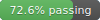
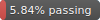
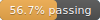

# Protobuf Conformance Tests

A repository which runs the protocol buffers
[conformance test suite](https://github.com/protocolbuffers/protobuf/tree/main/conformance) against various implementations.

## Implementations

The current implementations being tested are:

<!-- LIST-START -->

* Protobuf-ES: https://github.com/bufbuild/protobuf-es
* protobuf-ts: https://github.com/timostamm/protobuf-ts
* google-protobuf: https://github.com/protocolbuffers/protobuf-javascript
* ts-proto: https://github.com/stephenh/ts-proto
* protoscript: https://github.com/TateThurston/protoscript
* protoc-gen-ts: https://github.com/thesayyn/protoc-gen-ts
* protobuf.js: https://github.com/protobufjs/protobuf.js

<!-- LIST-END -->

## Results

<!-- TABLE-START -->

| Implementation | JavaScript and TypeScript | Standard Plugin | Editions | Required tests | Recommended tests |
|---|:---:|:---:|:---:|:---:|:---:|
| [Protobuf-ES](impl/protobuf-es) | :heavy_check_mark: | :heavy_check_mark: | :heavy_check_mark: |  (0&nbsp;failures) |  (0&nbsp;failures) |
| [protobuf-ts](impl/protobuf-ts) | :heavy_check_mark: | :heavy_check_mark: | :x: |  (3&nbsp;failures) |  (1&nbsp;failures) |
| [google-protobuf](impl/google-protobuf) | :x: | :heavy_check_mark: | :x: |  (646&nbsp;failures) |  (304&nbsp;failures) |
| [ts-proto](impl/ts-proto) | :x: | :heavy_check_mark: | :x: |  (737&nbsp;failures) |  (611&nbsp;failures) |
| [protoscript](impl/protoscript) | :heavy_check_mark: | :heavy_check_mark: | :x: |  (1137&nbsp;failures) |  (533&nbsp;failures) |
| [protoc-gen-ts](impl/protoc-gen-ts) | :x: | :heavy_check_mark: | :x: |  (1675&nbsp;failures) |  (470&nbsp;failures) |
| [protobuf.js](impl/protobuf.js) | :heavy_check_mark: | :x: | :heavy_check_mark: |  (1827&nbsp;failures) |  (568&nbsp;failures) |

<!-- TABLE-END -->

Since Editions are relatively new, only implementations that advertise support are tested with Editions. 

Note: None of the libraries tested implement the text format, so the results for those test runs are not shown.

## Running the tests

To run the conformance tests, run `npm test` from the repo root.

Note that only Linux and OSX operating systems are supported.
